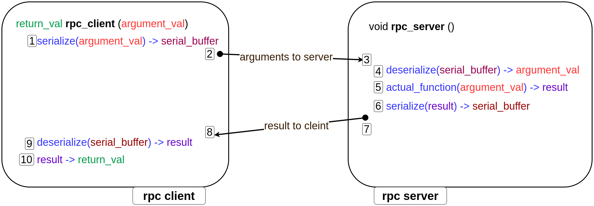

# Remote-Procedure-Call-in-C
## Introcution
This repository contains a simple remote procedure call implementation in c. 
### What is Remote Procedure call?
* Remote procedure call is mechanism that allows communication between different computing systems.
* Its purpose is to enable a client machine program to execute a procedure or function on a remote server as if it was a local call.

## Components of implementing RPC
* **Serialization and Deserialization**
* **Socket programming**

## Serialization and Deserialization

### What is Serialization ?
Serialization is the process of converting a memory object to a flat structure which can be sent over the network. It is
created in such a way that it is independent of the underlying machine.


### What is Deserialization ?
Deserialization is the process of converting the  serialized flat structure cr original application state in 
the reciever machine. This is done to recreate the original structure in the recieving machine.


### Why do we need serialization and deserialization?
To make the **application state independent of machine, os, compiler, architecture, endianess, etc.**\
We want to convert our application state into a form independent of the above mentioned factors and can be re-created for the specific situation.

### Examples of Serialization and Deserialization

#### 1. Simple Struct: [link](1.serialize-deserialize-primitives/examples/1.simple-struct/simple-struct.c)
```
typedef struct employee_t 
{ 
    // only primitive types
    int id;
    char first_name[30];
    char last_name[30];
}employee_t;
```
#### 2. Embedded Struct: [link](1.serialize-deserialize-primitives/examples/2.embedded-struct/embedded-struct.c)
```
typedef struct company_t
{
    char name[30];
    employee_t CEO; // embedded employee_t struct
    int valuation;
    int start_year;
}company_t;
```
#### 3. Nested Struct: [link](1.serialize-deserialize-primitives/examples/3.nested-struct/nested-struct.c)
```
typedef struct employee_performance_t
{
    char company_name[30];
    employee_t *emp; // nested struct
    int rating;
}employee_performance_t;
```

## Socket Programming
* Socket programming is used for communication between processes/machines.
* Used UDP for fast data transfer
* To demonstrate this there are two programs : client.c and receiver.c
#### client.c: [link](2.socket-programming/client.c)
```
int main(){
    // sends data = 101 
    // receives data+1 from server
    // check client.c for details
}
```
#### server.c: [link](2.socket-programming/server.c)
```
int main(){
    // receives data = 101 
    // sends data+1 to client
    // check server.c for details
}
```

## RPC Implementation
* In order to implement rpc serialization-deserialization and socket programming are used.
* The image below illustrates the implementation of rpc.



### Example: lst_sum function

#### lst_data: argument type of lst_sum
```
typedef struct lst_data{
    int data;
    struct lst_data *next;
}lst_data;
```

#### lst_sum signature
```
int lst_sum(lst_data *head){
    // returns sum of all elements in a list
}
```

The below file contains its implementation :  
**client_rpc.c**: [link](.pictures/rpc_illustration.png "RPC Illustration")
**server_rpc.c**: [link](.pictures/rpc_illustration.png "RPC Illustration")
